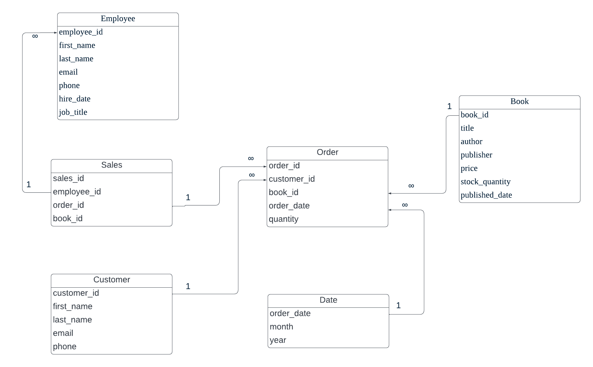
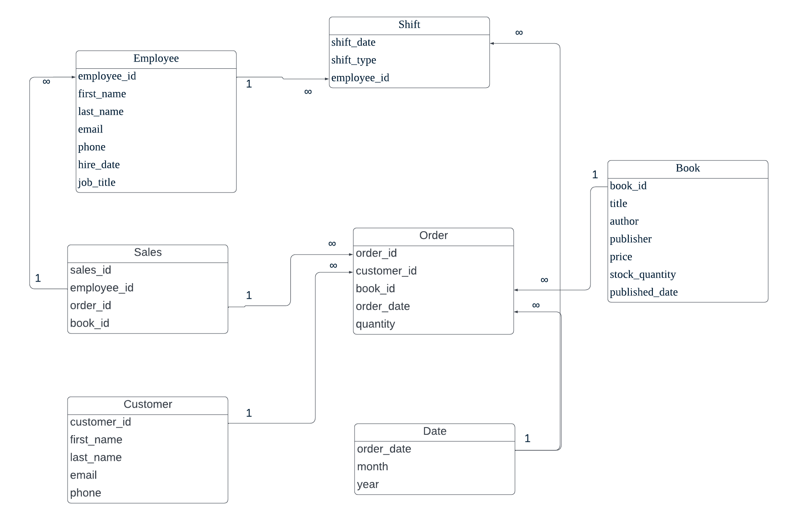

# Assignment 2: Design a Logical Model and Advanced SQL

🚨 **Please review our [Assignment Submission Guide](https://github.com/UofT-DSI/onboarding/blob/main/onboarding_documents/submissions.md)** 🚨 for detailed instructions on how to format, branch, and submit your work. Following these guidelines is crucial for your submissions to be evaluated correctly.

#### Submission Parameters:
* Submission Due Date: `December 22, 2024`
* Weight: 70% of total grade
* The branch name for your repo should be: `assignment-two`
* What to submit for this assignment:
    * This markdown (AssignmenPRAGMA grams (preferably in a pdf, jpeg, png format).
    * One .sql file 
* What the pull request link should look like for this assignment: `https://github.com/<your_github_username>/sql/pulls/<pr_id>`
    * Open a private window in your browser. Copy and paste the link to your pull request into the address bar. Make sure you can see your pull request properly. This helps the technical facilitator and learning support staff review your submission easily.

Checklist:
- [ ] Create a branch called `assignment-two`.
- [ ] Ensure that the repository is public.
- [ ] Review [the PR description guidelines](https://github.com/UofT-DSI/onboarding/blob/main/onboarding_documents/submissions.md#guidelines-for-pull-request-descriptions) and adhere to them.
- [ ] Verify that the link is accessible in a private browser window.

If you encounter any difficulties or have questions, please don't hesitate to reach out to our team via our Slack at `#cohort-5-help`. Our Technical Facilitators and Learning Support staff are here to help you navigate any challenges.

***

## Section 1:
You can start this section following *session 1*, but you may want to wait until you feel comfortable wtih basic SQL query writing. 

Steps to complete this part of the assignment:
- Design a logical data model
- Duplicate the logical data model and add another table to it following the instructions
- Write, within this markdown file, an answer to Prompt 3


###  Design a Logical Model

#### Prompt 1
Design a logical model for a small bookstore. 📚

At the minimum it should have employee, order, sales, customer, and book entities (tables). Determine sensible column and table design based on what you know about these concepts. Keep it simple, but work out sensible relationships to keep tables reasonably sized. 

Additionally, include a date table. 

There are several tools online you can use, I'd recommend [Draw.io](https://www.drawio.com/) or [LucidChart](https://www.lucidchart.com/pages/).

**HINT:** You do not need to create any data for this prompt. This is a conceptual model only. 

#### Prompt 2
We want to create employee shifts, splitting up the day into morning and evening. Add this to the ERD.

#### Prompt 3
The store wants to keep customer addresses. Propose two architectures for the CUSTOMER_ADDRESS table, one that will retain changes, and another that will overwrite. Which is type 1, which is type 2? 

**HINT:** search type 1 vs type 2 slowly changing dimensions. 

```
Your answer...
```

***

## Section 2:
You can start this section following *session 4*.

Steps to complete this part of the assignment:
- Open the assignment2.sql file in DB Browser for SQLite:
	- from [Github](./02_activities/assignments/assignment2.sql)
	- or, from your local forked repository  
- Complete each question


### Write SQL

#### COALESCE
1. Our favourite manager wants a detailed long list of products, but is afraid of tables! We tell them, no problem! We can produce a list with all of the appropriate details. 

Using the following syntax you create our super cool and not at all needy manager a list:
```
SELECT 
product_name || ', ' || product_size|| ' (' || product_qty_type || ')'
FROM product
```

But wait! The product table has some bad data (a few NULL values). 
Find the NULLs and then using COALESCE, replace the NULL with a blank for the first problem, and 'unit' for the second problem. 

**HINT**: keep the syntax the same, but edited the correct components with the string. The `||` values concatenate the columns into strings. Edit the appropriate columns -- you're making two edits -- and the NULL rows will be fixed. All the other rows will remain the same.

```sql
SELECT 
	product_name || ', ' || 
	COALESCE(product_size, ' ') || ' (' || 
	COALESCE(product_qty_type, 'unit') || ')' AS new_product
FROM product;
```
#### Windowed Functions
1. Write a query that selects from the customer_purchases table and numbers each customer’s visits to the farmer’s market (labeling each market date with a different number). Each customer’s first visit is labeled 1, second visit is labeled 2, etc. 

You can either display all rows in the customer_purchases table, with the counter changing on each new market date for each customer, or select only the unique market dates per customer (without purchase details) and number those visits. 

**HINT**: One of these approaches uses ROW_NUMBER() and one uses DENSE_RANK().

```sql
-- ROW_NUMBER()
SELECT 
	customer_id, market_date,
	ROW_NUMBER() OVER (PARTITION BY customer_id ORDER BY market_date ASC) AS visit_number
FROM customer_purchases
GROUP BY customer_id, market_date
ORDER BY customer_id, market_date;

-- DENSE_RANK()
SELECT 
	customer_id, market_date,
	DENSE_RANK() OVER (PARTITION BY customer_id ORDER BY market_date ASC) AS visit_number
FROM customer_purchases
ORDER BY customer_id, market_date;
```

2. Reverse the numbering of the query from a part so each customer’s most recent visit is labeled 1, then write another query that uses this one as a subquery (or temp table) and filters the results to only the customer’s most recent visit.

```sql
--ROW_NUMBER
SELECT * 
FROM(
	SELECT customer_id,market_date,
	ROW_NUMBER() OVER(PARTITION BY customer_id ORDER BY market_date DESC) AS visit_number
FROM customer_purchases 
GROUP BY customer_id, market_date
) x
WHERE x.visit_number = 1
ORDER BY customer_id,market_date;

--DENSE_RANK
SELECT *
FROM(
	SELECT customer_id,market_date,
	DENSE_RANK() OVER (PARTITION BY customer_id ORDER BY market_date DESC) AS visit_number
FROM customer_purchases
) x
WHERE x.visit_number = 1
ORDER BY customer_id, market_date;
```

3. Using a COUNT() window function, include a value along with each row of the customer_purchases table that indicates how many different times that customer has purchased that product_id.

```sql
SELECT customer_id, product_id,market_date,
	COUNT(product_id) OVER (PARTITION BY customer_id, product_id) AS purchase_count
FROM customer_purchases
GROUP BY customer_id, product_id;
```

#### String manipulations
1. Some product names in the product table have descriptions like "Jar" or "Organic". These are separated from the product name with a hyphen. Create a column using SUBSTR (and a couple of other commands) that captures these, but is otherwise NULL. Remove any trailing or leading whitespaces. Don't just use a case statement for each product! 

| product_name               | description |
|----------------------------|-------------|
| Habanero Peppers - Organic | Organic     |

**HINT**: you might need to use INSTR(product_name,'-') to find the hyphens. INSTR will help split the column. 

```sql
SELECT *, 
	CASE 
		WHEN INSTR(product_name, '-') > 0 THEN TRIM(SUBSTR(product_name, INSTR(product_name, '-') + 1 ))
	ELSE NULL
	END as description
FROM product
ORDER BY product_id;
```

#### UNION
1. Using a UNION, write a query that displays the market dates with the highest and lowest total sales.

**HINT**: There are a possibly a few ways to do this query, but if you're struggling, try the following: 1) Create a CTE/Temp Table to find sales values grouped dates; 2) Create another CTE/Temp table with a rank windowed function on the previous query to create "best day" and "worst day"; 3) Query the second temp table twice, once for the best day, once for the worst day, with a UNION binding them. 

```sql
-- Drop table if exists
DROP TABLE IF EXISTS temp.customer_purchases_new;
-- Create a table
CREATE TABLE temp.customer_purchases_new AS
SELECT market_date,
	SUM(cost_to_customer_per_qty * quantity) as total_sales
FROM customer_purchases
GROUP BY market_date
ORDER BY total_sales DESC;

SELECT * 
FROM (
    SELECT MAX(total_sales) as total_sales, market_date, 'best day' as results,
    RANK () OVER (ORDER BY total_sales DESC) as rank
    FROM customer_purchases_new
    GROUP BY market_date
    ORDER BY total_sales DESC 
) x
WHERE rank =  1
UNION ALL
SELECT * 
FROM (
    SELECT MIN(total_sales) as total_sales, market_date, 'worst day' as results,
    RANK () OVER (ORDER BY total_sales ASC) as rank
    FROM customer_purchases_new
    GROUP BY market_date
    ORDER BY total_sales ASC 
) x
WHERE rank =  1;
```

## Section 3:
You can start this section following *session 5*.

Steps to complete this part of the assignment:
- Open the assignment2.sql file in DB Browser for SQLite:
	- from [Github](./02_activities/assignments/assignment2.sql)
	- or, from your local forked repository  
- Complete each question

### Write SQL

#### Cross Join
1. Suppose every vendor in the `vendor_inventory` table had 5 of each of their products to sell to **every** customer on record. How much money would each vendor make per product? Show this by vendor_name and product name, rather than using the IDs.

**HINT**: Be sure you select only relevant columns and rows. Remember, CROSS JOIN will explode your table rows, so CROSS JOIN should likely be a subquery. Think a bit about the row counts: how many distinct vendors, product names are there (x)? How many customers are there (y). Before your final group by you should have the product of those two queries (x\*y). 

```sql
SELECT vendor_name, product_name, original_price,
SUM(paid_money) as paid_money
FROM(SELECT DISTINCT vendor_name, product_name, original_price, (original_price * 5) as paid_money
	FROM vendor_inventory vi
    JOIN product p ON vi.product_id =  p.product_id
    JOIN vendor v ON vi.vendor_id =  v.vendor_id
     ) x
     CROSS JOIN (SELECT  DISTINCT customer_id
     FROM customer)
GROUP BY vendor_name, product_name;
```

#### INSERT
1. Create a new table "product_units". This table will contain only products where the `product_qty_type = 'unit'`. It should use all of the columns from the product table, as well as a new column for the `CURRENT_TIMESTAMP`.  Name the timestamp column `snapshot_timestamp`.

```sql
-- DROP if EXISTS
DROP TABLE IF EXISTS product_units;
-- Now creat a new table called product_units
/*
CREATE TABLE product_units (
	product_id,
	product_name, 
	product_size, 
	product_category_id, 
	product_qty_type, 
	snapshot_timestamp); 
*/

CREATE TABLE product_units AS
	SELECT *,
	CURRENT_TIMESTAMP AS snapshot_timestamp
FROM product
WHERE product_qty_type = 'unit';
```

2. Using `INSERT`, add a new row to the product_unit table (with an updated timestamp). This can be any product you desire (e.g. add another record for Apple Pie). 

```sql
INSERT INTO product_units (product_id, product_name,  product_size, product_category_id, product_qty_type, snapshot_timestamp)
VALUES(21, 'Apple Pie', 'Large', '3', 'unit', CURRENT_TIMESTAMP) 

-- Please check the insertion
SELECT * 
FROM product_units
WHERE product_name = 'Apple Pie';
```

#### DELETE 
1. Delete the older record for the whatever product you added.

**HINT**: If you don't specify a WHERE clause, [you are going to have a bad time](https://imgflip.com/i/8iq872).

```sql
WITH older_record AS(
	SELECT product_id
    FROM product_units 
    WHERE product_id = 21)

DELETE FROM product_units
WHERE (product_id =  (SELECT  product_id FROM older_record)
);
-- Please check if deleted
SELECT *
FROM product_units
WHERE product_name = 'Apple Pie';
```

#### UPDATE
1. We want to add the current_quantity to the product_units table. First, add a new column, `current_quantity` to the table using the following syntax.
```
ALTER TABLE product_units
ADD current_quantity INT;
```

Then, using `UPDATE`, change the current_quantity equal to the **last** `quantity` value from the vendor_inventory details. 

**HINT**: This one is pretty hard. First, determine how to get the "last" quantity per product. Second, coalesce null values to 0 (if you don't have null values, figure out how to rearrange your query so you do.) Third, `SET current_quantity = (...your select statement...)`, remembering that WHERE can only accommodate one column. Finally, make sure you have a WHERE statement to update the right row, you'll need to use `product_units.product_id` to refer to the correct row within the product_units table. When you have all of these components, you can run the update statement.
```sql
ALTER TABLE product_units
ADD current_quantity INT;

UPDATE product_units
SET current_quantity = (
	SELECT coalesce(SUM(quantity), 0)
    FROM vendor_inventory 
    WHERE product_id = product_units.product_id);

	
SELECT * 
FROM product_units;
```